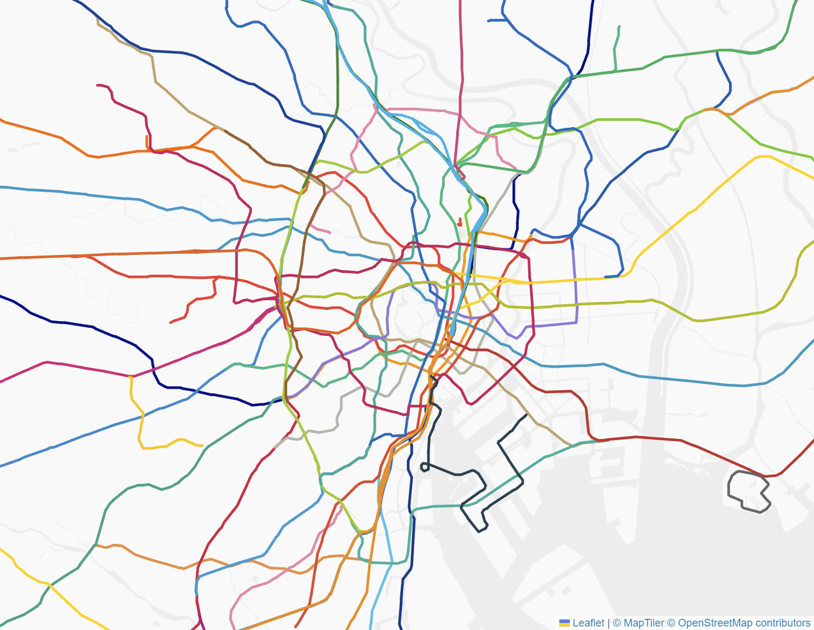

# 日本の鉄道ラインカラー (CSVファイル)
- 運営会社名・路線名は[国土数値情報 鉄道データ](https://nlftp.mlit.go.jp/ksj/gml/datalist/KsjTmplt-N02-v3_1.html)に基づきます。
- [国土数値情報 鉄道データ](https://nlftp.mlit.go.jp/ksj/gml/datalist/KsjTmplt-N02-v3_1.html)と合わせることで、下図のような色分けされた路線図を作ることができます。
- 不確定情報、欠損などを含むので、正確性を求める用途には向きません。
- 誤情報の報告は[こちら](https://github.com/takumif/railway_colors_japan/issues/new)までお願いします。

# Japanese railway line colors in a CSV file
- The operator and line names are based on the [data](https://nlftp.mlit.go.jp/ksj/gml/datalist/KsjTmplt-N02-v3_1.html) from the National Land Information Division of the National Spatial Planning and Regional Policy Bureau of Japan.
- Combined with their [data](https://nlftp.mlit.go.jp/ksj/gml/datalist/KsjTmplt-N02-v3_1.html), you can draw a colored map like below.
- The data currently contains inaccuracies and omissions so it's not suitable for uses that require accuracy.
- If you spot any inaccuracies please [file an issue](https://github.com/takumif/railway_colors_japan/issues/new).

